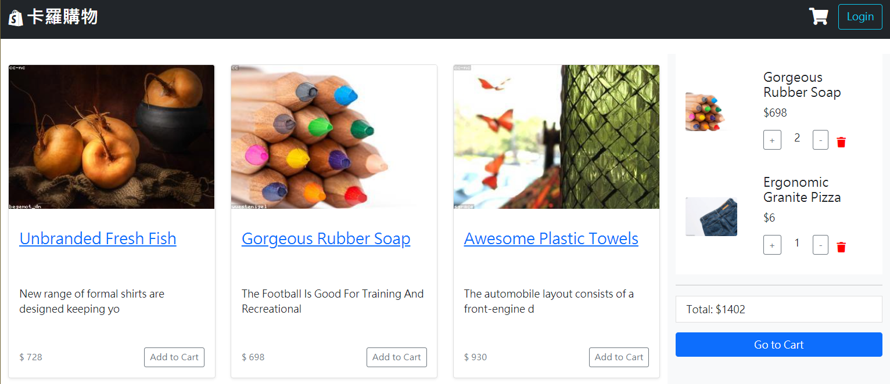

# Shopping-Cart

使用 Node.js,Express 框架,MySQL 資料庫實作購物平台，包含基本的 crud 功能、資料庫建置、登入驗證、金流串接、第三方 API 串接，打造一個使用者可以輕鬆熟悉的介面，在網站上直接完成一系列的購物流程。

## 部署至 Heroku

```
https://shopping-cart-mysql.herokuapp.com/
```

## 可使用帳號

```
Admin
email: root@example.com
Password: 12345678

User
Account: user1@example.com
Password: 12345678
```

## Features - 產品功能

### 首頁



<後台登入 & 相關頁面>

1. 有 admin 權限的帳號(管理者)才可以登入&登出
2. 管理者可以瀏覽全部商品資訊
3. 管理者可以新增、編輯、刪除單一商品
4. 管理者可以瀏覽全部訂單資訊
5. 管理者可以出貨、取消、恢復單一訂單
6. 管理者可以瀏覽使用者資訊
7. 管理者可以修改單一使用者權限

<前台登入 & 註冊頁面>

1. 使用者需設定信箱、密碼，並輸入驗證碼，才可以註冊成功
2. 使用者註冊成功後，可以登入

<首頁-商品頁面>

1. 點擊 卡羅購物(首頁左上角) -> 任何情況下點擊均會回到首頁
2. 點擊 Logout(首頁右上角) -> 任何情況下點擊均會登出，並回到登入頁面
3. 使用者可瀏覽所有商品資訊
4. 使用者可以加入商品至購物車
5. 使用者可以在商品頁的右側面板，看到購物車內容&總金額
6. 使用者可以在商品頁的右側面板，加減購物車內商品的數量
7. 使用者進入購物車時，會被要求登入

<購物車頁面>

1. 使用者可瀏覽所有購物車內的商品資訊
2. 使用者可以加減購物車內商品的數量
3. 使用者可以填寫姓名、電話、住址後，送出訂單

<訂單頁面>

1. 使用者可以瀏覽自己的全部訂單
2. 使用者可以在商品未出貨前，取消訂單
3. 使用者可以線上付款

## Installing - 專案安裝流程

1. 開啟終端機，執行以下指令 :

> `$ git clone https://github.com/KarolChang/shopping_cart.git`

2. 進入專案資料夾

> `$ cd shopping_cart`

3. 透過 npm 安裝套件

> `$ npm install`

4. 安裝 nodemon

> `$ npm install -g nodemon`

5. 新增 .env 檔案 (請參考.env.example 檔案)

6. 使用 MySQL 資料庫

(1) 請至 config 資料夾設定 config.json 檔案

```
{
  "development": {
    "username": "root",
    "password": "<your_mysql_workbench_password>",
    "database": "shopping_cart",
    "host": "127.0.0.1",
    "dialect": "mysql"
  },
  "test": {
    "username": "root",
    "password": "<your_mysql_workbench_password>",
    "database": "shopping_cart_test",
    "host": "127.0.0.1",
    "dialect": "mysql"
  }
}
```

(2) 到 MySQL 創建資料庫

```
drop database if exists ac_twitter_workspace;
create database ac_twitter_workspace;
drop database if exists ac_twitter_workspace_test;
create database ac_twitter_workspace_test;
```

(3) 同步資料庫 & 新增種子資料

> `$ npx sequelize db:migrate`

> `$ npx sequelize db:seed:all`

7. 使用腳本啟動專案

> `$ npm run seed`

> 在瀏覽器進入 http://localhost:3000

## Environment & Tools - 環境&使用工具

- [Visual Studio Code 編輯器](https://code.visualstudio.com/)
- [Node.js (v10.15.0)](https://nodejs.org/en/)
- [Express 框架](https://www.npmjs.com/package/express)
- [Express handlebars 模板引擎](https://www.npmjs.com/package/express-handlebars)
- [body-parser](https://www.npmjs.com/package/body-parser)
- [method-override](https://www.npmjs.com/package/method-override)
- [express-session](https://www.npmjs.com/package/express-session)
- [passport](https://www.npmjs.com/package/passport)
- [passport-jwt](https://www.npmjs.com/package/passport-jwt)
- [jsonwebtoken](https://www.npmjs.com/package/jsonwebtoken)
- [bcryptjs](https://www.npmjs.com/package/bcryptjs)
- [dotenv](https://www.npmjs.com/package/dotenv)
- [crypto-js](https://www.npmjs.com/package/crypto-js)
- [mysql2](https://www.npmjs.com/package/mysql2)
- [sequelize](https://www.npmjs.com/package/sequelize)
- [sequelize-cli](https://www.npmjs.com/package/sequelize-cli)
- [multer](https://www.npmjs.com/package/multer)
- [imgur-node-api](https://www.npmjs.com/package/imgur-node-api)
- [nodemailer](https://www.npmjs.com/package/nodemailer)
- [connect-flash](https://www.npmjs.com/package/connect-flash)
- [faker](https://www.npmjs.com/package/faker)
